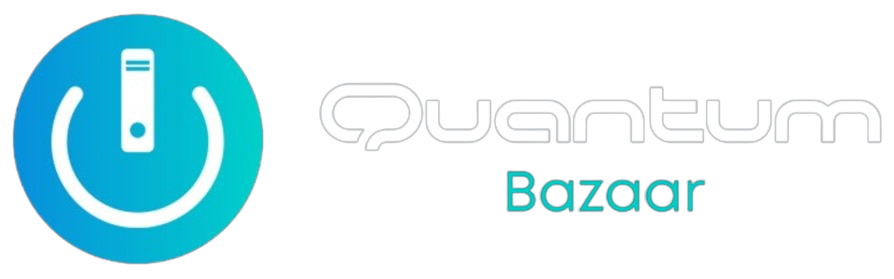

# Quantum Bazaar - MERN eCommerce Project

## Description

Quantum Bazaar is an eCommerce platform built using the MERN stack (MongoDB, Express.js, React, Node.js). It offers a user-friendly interface for buying and selling products online, complete with user authentication (jwt-passport), product management, cart functionality, and payment integration (stripe).

## Table of Contents

- [Technologies Used](#technologies-used)
- [Features](#features)
- [Installation](#installation)
- [Usage](#usage)
- [Folder Structure](#folder-structure)
- [APIs](#apis)
- [Database Schema](#database-schema)
- [Acknowledgments](#acknowledgments)

## Technologies Used

- MongoDB
- Express.js
- React
- Node.js
- Stripe API (for payments)
- Tailwind CSS (for styling/UI)

## Features

- User authentication (signup, login, logout), keeps checking for authentication on every reload
- Product listing with categories/brands and sort functionality
- Shopping cart management
- Secure payment integration using Stripe
- User profile and order history
- Admin Product Listing with Add/Edit product
- Admin Orders page, contains all the orders

## Installation

1. Clone the repository.
2. Navigate to the project directory Frontend/Backend.

**Frontend:**

- Install dependencies using `npm install --force`.
- Add your Stripe public key in Frontend (StripeCheckout Page)
- Run `npm start` to start the react frontend.

**Backend:**

- Install dependencies using `npm install`.
- Set up environment variables in Backend :-
  - PORT
  - MONGODB_URL
  - ENDPOINT_SECRET (Stripe Webhook)
  - STRIPE_SERVER_KEY
  - JWT_SECRET_KEY
  - MAIL_PASSWORD (Gmail for App Use password)
- Run `npm run dev` to start the development server with Nodemon.
- Run `mongod --dbpath <data location>` to start mongodb database locally.

## Usage

1. Visit the deployed [website](https://quantum-bazaar.onrender.com) or run locally.
2. Sign up or log in to access the features or use the Guest login button.
3. Browse products, add items to the cart, and proceed to checkout.
4. Complete the payment process using the provided payment methods.

## Folder Structure

- Frontend (React front-end)
  - public (Static assets)
  - app (Constants & Store)
  - auth (Components & API)
  - cart (Component & API)
  - common (Common Components)
  - navbar (Component)
  - order (API)
  - product (Components & API)
  - user (Components & API)
  - pages (Includes all the pages)   
- Backend (Node.js & Express back-end)
  - controller (Logic handling)
  - model (Database schema and models)
  - routes (API routes)
  - services (Common file - Includes common functions)

## APIs

- **Authentication API**: `/auth`
- **Product API**: `/products`
- **Cart API**: `/cart`
- **Order API**: `/order`
- **User API**: `/user`
<!-- - **Payment API**: `/api/payment` -->

## Database Schema

The MongoDB database consists of the following collections:

- Brand
- Cart
- Category
- Order
- Product
- Users

<!-- ## Screenshots

 -->

<!-- ## Roadmap

- Implement user reviews and ratings for products.
- Enhance the admin panel for better product management.
- Introduce internationalization for multi-language support. -->

## Acknowledgments

This project wouldn't have been possible without the invaluable contributions and support from various individuals and resources:

- **Open Source Community**: For providing an ecosystem of tools, libraries, and resources that significantly aided the development process.

- **MongoDB, Express.js, React, Node.js (MERN Stack)**: The robustness and versatility of these frameworks empowered the creation of this project.

- **Stripe**: For offering a secure and seamless payment gateway, enhancing the platform's functionality.

- **Tailwind CSS**: Its utility-first approach facilitated rapid UI development and styling.

Thank you to everyone who played a role, directly or indirectly, in the realization of this project!
